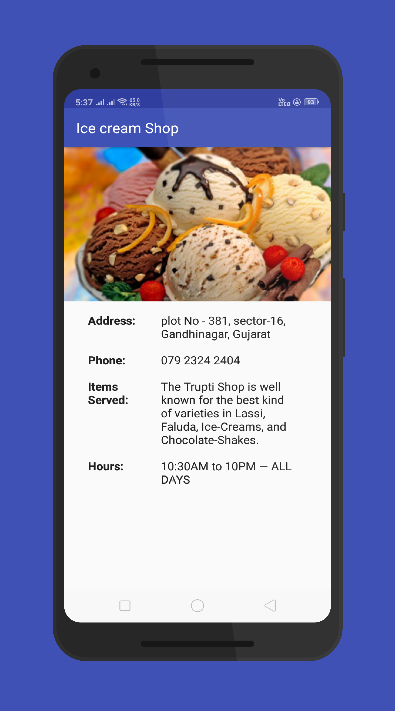

# SingleScreenApp
This is the first project I've submitted to Udacity for the Android Basics NanoDegree. 
The main criteria of the Project is to Design and implement a single screen app that displays information about a fictional small business. 

## Screenshots

